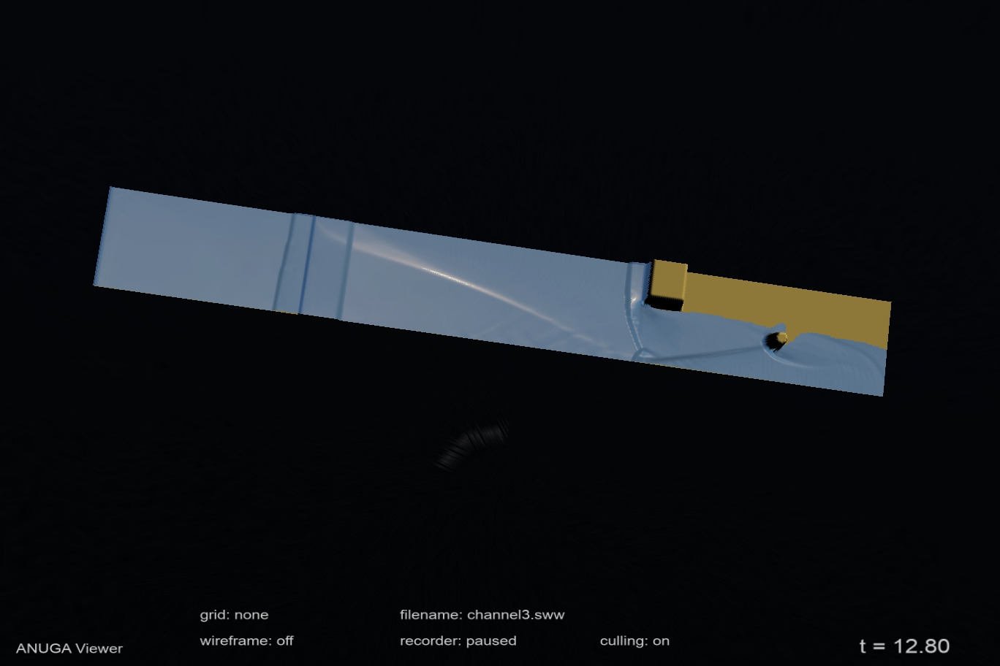

.. _use_anuga_viewer:

ANUGA Viewer
============

The output from an ANUGA simulation is a `netcdf` file with a `sww` extension. 
SWW files can be viewed using the `anuga-viewer`. 

`anuga-viewer` is developed on `github` at https://github.com/anuga-community/anuga-viewer

   View of channel3.sww (produced using `anuga_core/examples/simple_examples/channel3.py`) using the ANUGA viewer

Controls
--------

* Hold the left mouse button and drag to spin the model.
* Hold the right mouse button and drag to change the zoom distance.
* Hold both mouse buttons down or hold the middle button to slide around the model.
* Hold down shift and click on the water with the left mouse button to show a timeseries plot. The data shown depends on the view mode.
* Click on something that is not water, or click without holding shift to hide the timeseries plot.
* Press h to show/hide the help screen. Here are some of the controls:
  * Press r to reset the view (sometimes useful if you get lost).
  * Press t to cycle through the view modes (stage, momentum).
  * Press w to toggle wireframe modes.

Applying Textures
-----------------

* Applying images (ie textures) to the bedslope mesh can be done with the --texture command line option. For example:

.. code-block:: bash

   anuga_viewer.exe -texture ..\images\bedslope.jpg ..\data\cairns.sww

* There are two possible ways the texture is mapped onto the bedslope mesh, based on the texture format.

   1. If the texture file contains GDAL geodata, this will be used to map the texture onto the mesh.

   2. Otherwise, the texture will be projected directly from above, in a rectangle that exactly bounds the bedslope.

* In summary, if you load a GDAL texture, it will map the texture onto the mesh using the data in the texture file. 
Otherwise (if you are using a jpeg, tiff, etc.) it will naively map the texture onto the mesh, 
as if a projector beam was pointing directly downwards, situated so that the 
image would just cover every corner of the bedslope mesh.
    

