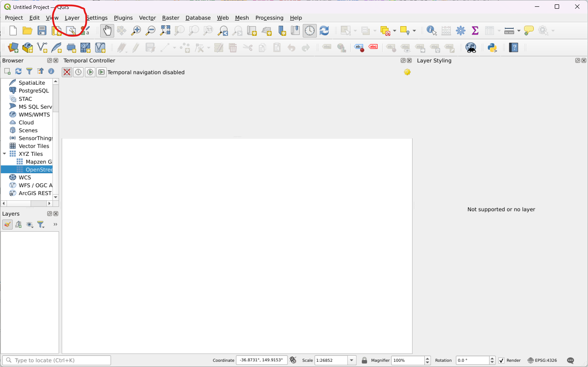
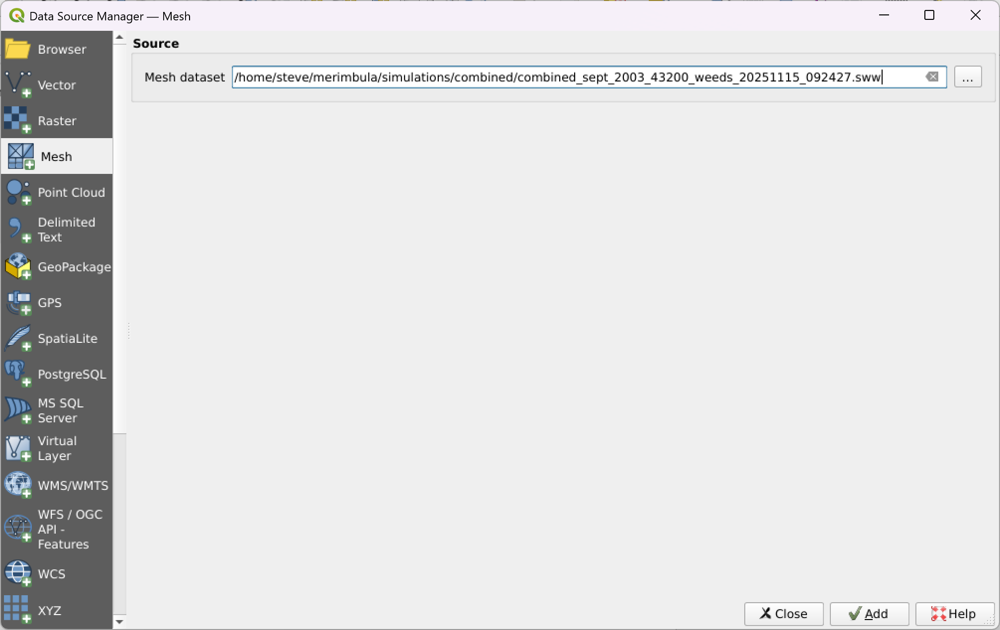
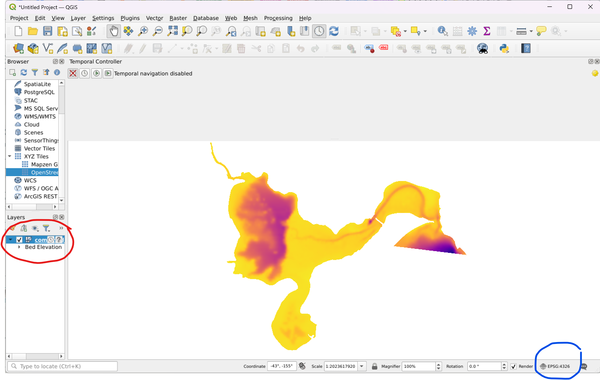
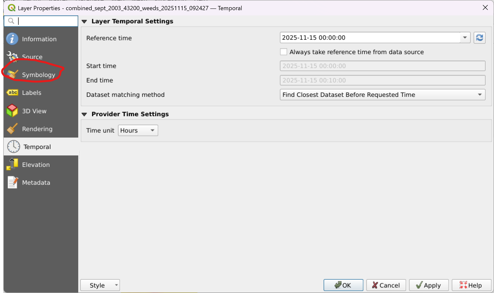
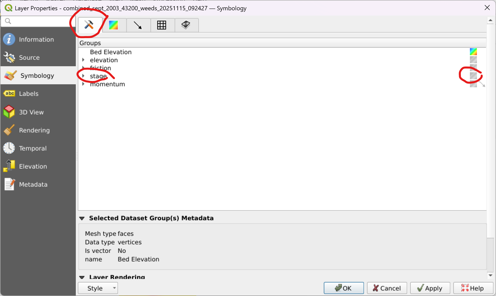
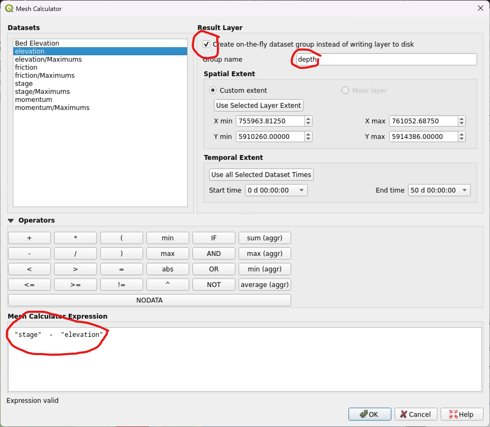
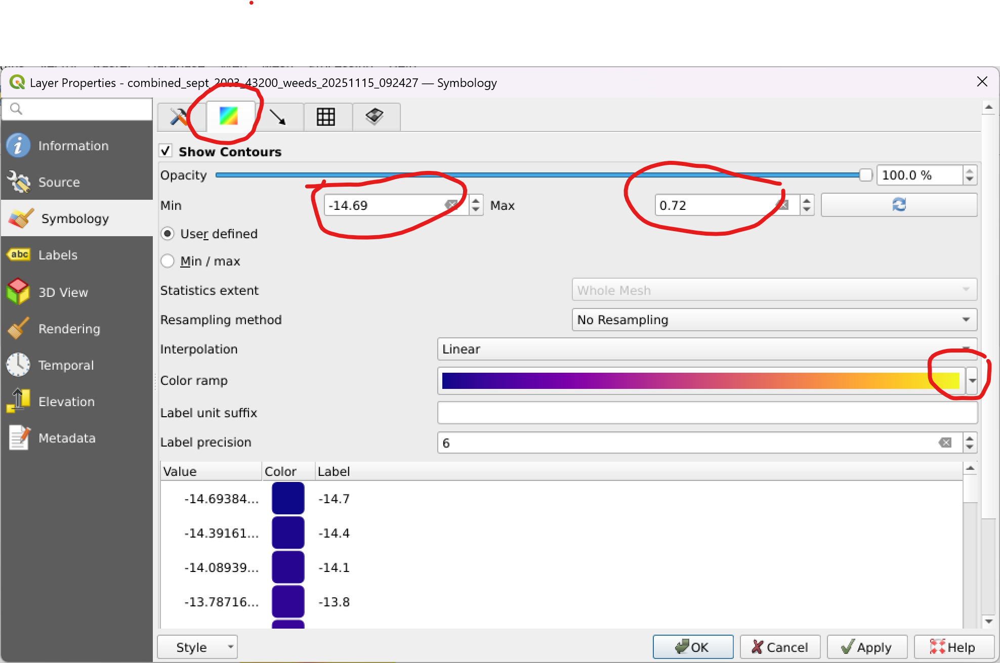
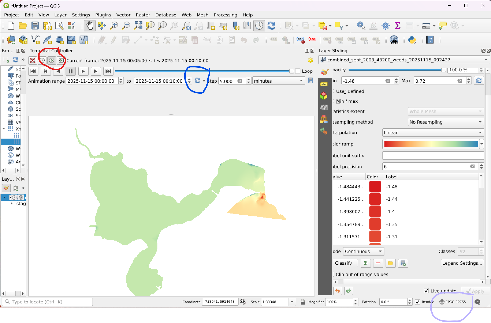

.. _use_qgis:

Visualise with QGIS
=====================

You can use `QGIS` to visualise ANUGA simulation results stored in `sww` files.
    

Opening sww files in QGIS
--------------------------

Open QGIS. 

This document uses QGIS 3.x (tested with version 3.42).

From the "layer" menu choose "Data Source Manager"

    
This give you a file choice. Choose your \*.sww file. Add the new mesh layer.

    

Choose (double click) the new mesh layer that has been created. 

Set the CRS (Coordinate Reference System) to the appropriate value.
At present QGIS does not automatically read the georeference information from the sww file.
You will need to set this manually. Something like "EPSG:32756 - WGS 84 / UTM zone 56S"

   

Open the "Layer Styling Panel". And then open the "Symbology" tab.

From the "Datasets" tab choose the quantity you want to visualize.  The options are elevation, stage, friction and momentum. Stage is a good first choice.

  * Choose by clicking the small square on the right of the panel. Should show as a coloured square.

  * Vector quantities such as momentum can be visualized using arrows.

Derived quantities such as depth can be created using QGIS's mesh calculator, which is found in the main menu "Mesh" tab.

  * I tend to choose "create on the fly" option.
 
  * You need to name your new quantity, for instance "depth"

  * Enter the expression for your new quantity. For depth:  stage - elevation  

From the "Contours" tab choose the colour ramp, min and max.

The first timeslice of your dataset quantity should now be visible. 
You need to activate the temporal controller to step through time.

The "Time Controller Panel" may already be activated, but if not, from the ribbon, choose "Temporal Controller Panel". 

* The "temporal Contoller" has 4 options: "Off", "Fixed Range", "Animated" and "Movie". 
* Choose "Animated".
* When "Animated" is chosen, you should see a slider and controls. 
* We recommend that you update the "Animation Range".
* You should now be able to run through the chosen quantity's time series.

We recommend installing the Crayfish plugin for QGIS for visualising pointwise and cross-sectional 
time series data stored in sww files.

In general we recommend the following resources for learning QGIS:

  * https://docs.qgis.org/3.40/en/docs/user_manual/

  * https://www.qgistutorials.com/en/

