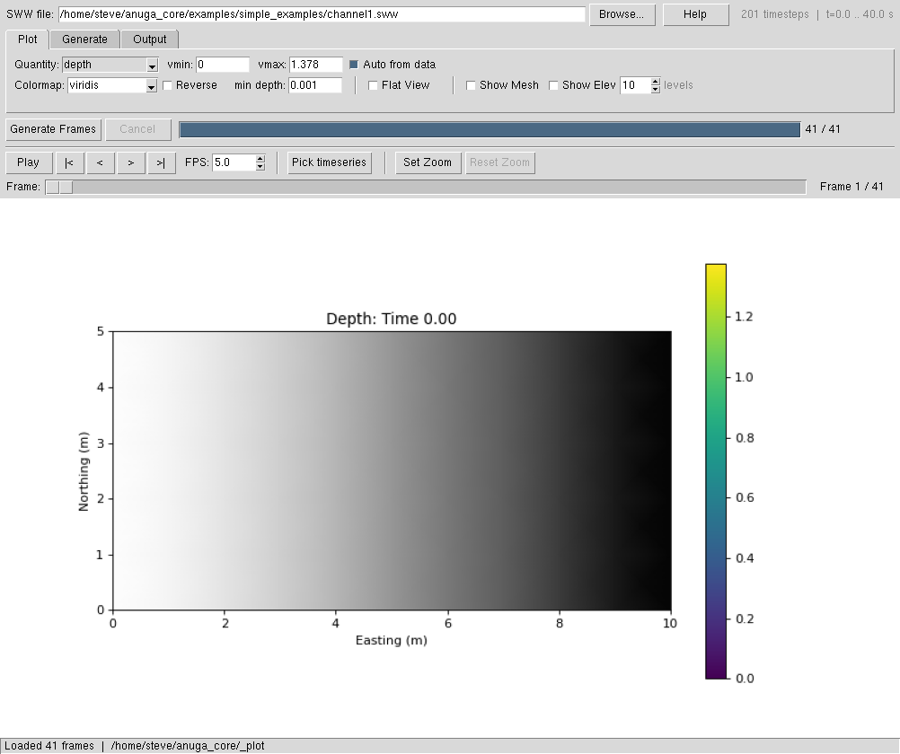
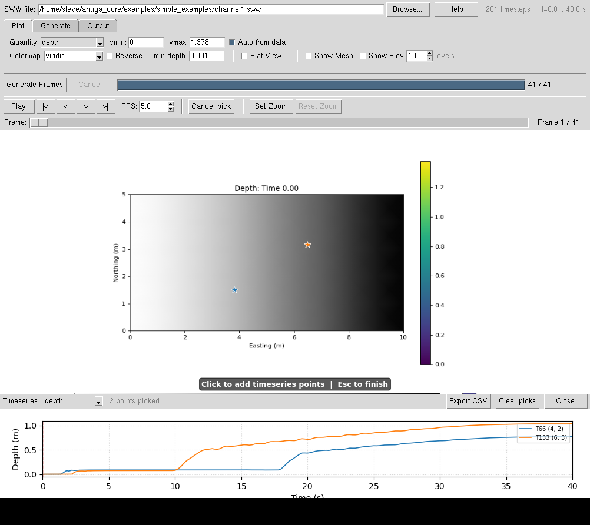
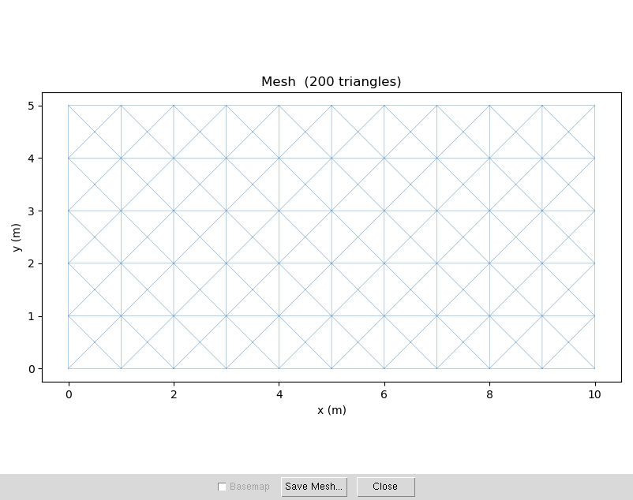

.. _sww_gui:

SWW Animation GUI (``anuga_sww_gui``)
======================================

``anuga_sww_gui`` is an interactive desktop application for
visualising and exploring the output of ANUGA simulations stored in SWW
files.  It generates PNG frames from a chosen quantity, plays them as an
animation, supports interactive timeseries extraction at any mesh point,
and can display the underlying triangulation mesh.

.. contents:: Contents
   :local:
   :depth: 2

Installation
------------

``anuga_sww_gui`` requires the optional ``gui`` extras::

    pip install anuga[gui]

or with conda::

    conda install contextily pillow

The core GUI requires **tkinter** (Python standard library on most platforms)
and **matplotlib** (installed as part of the core ``anuga`` dependency).

Optional but recommended:

.. list-table::
   :header-rows: 1
   :widths: 20 80

   * - Package
     - Purpose
   * - **contextily**
     - Tile basemap overlay (OpenStreetMap, Esri Satellite, etc.).
       Install: ``conda install contextily`` or ``pip install contextily``.
   * - **Pillow**
     - GIF animation export.
       Install: ``conda install pillow`` or ``pip install Pillow``.
   * - **ffmpeg**
     - MP4 animation export.  System tool, not a Python package.
       Install: ``conda install ffmpeg``, ``apt install ffmpeg``, or from
       https://ffmpeg.org.  Offered automatically when detected on ``PATH``.

Starting the GUI
----------------

From the command line::

    anuga_sww_gui

Pass an SWW file and/or an initial quantity to open directly::

    anuga_sww_gui --sww results/towradgi.sww --qty depth

Available quantities for ``--qty`` are:
``depth``, ``stage``, ``speed``, ``speed_depth``,
``max_depth``, ``max_speed``, ``max_speed_depth``,
``elev``.

   Main window after frame generation — tabbed interface with Plot, Generate,
   and Output tabs.  The always-visible Generate Frames bar and playback
   controls sit below the tabs.

Interface layout
----------------

The GUI is organised into three tabs plus always-visible bars:

.. list-table::
   :header-rows: 1
   :widths: 20 80

   * - Area
     - Contents
   * - **File row** (always visible)
     - SWW file path, Browse button, Help button, timestep / time-range info.
   * - **Plot tab**
     - Quantity, vmin/vmax/Auto, Colormap/Reverse, min depth, Flat View,
       Show Mesh, Show Elev + levels spinbox.
   * - **Generate tab**
     - Output directory/Browse, DPI, Every N frames stride, EPSG/Set,
       Basemap checkbox + provider combo, Alpha spinbox.
   * - **Output tab**
     - Save Frame, Export Frame, Save Animation, View Mesh, Save Mesh buttons.
   * - **Generate Frames bar** (always visible)
     - Generate Frames button, Cancel, progress bar, frame count label.
   * - **Playback bar** (always visible)
     - Play/Pause, step buttons, FPS, Pick timeseries, Set Zoom, Reset Zoom.
   * - **Frame slider** (always visible)
     - Drag to scrub through frames; frame number shown at right.
   * - **Status bar** (always visible, bottom)
     - Current status and last action message.

Quick-start workflow
--------------------

1. **Open an SWW file** — click *Browse…* next to *SWW file*, or type
   the path directly and press Enter.  The info bar shows the number of
   timesteps and the time range.

2. **Configure generation settings** — on the *Plot* tab choose a *Quantity*;
   *Auto from data* is ticked by default so vmin/vmax are set automatically.
   On the *Generate* tab adjust *DPI* and other options as needed.

3. **Click Generate Frames** — PNG files are written to the *Output dir*
   (default ``_plot``).  A progress bar tracks completion.  Click
   *Cancel* to abort early.

4. **Animate** — use the *Play* button and frame controls to step through
   or continuously play the animation.

Plot tab settings
-----------------

.. list-table::
   :header-rows: 1
   :widths: 20 80

   * - Setting
     - Description
   * - **Quantity**
     - The variable to plot.  Animated quantities (``depth``,
       ``stage``, ``speed``, ``speed_depth``) produce one PNG per
       selected timestep.  Maximum quantities (``max_depth``,
       ``max_speed``, ``max_speed_depth``) produce a single frame
       showing the spatial maximum over the entire simulation.
       ``elev`` plots bed elevation: one static frame when the SWW
       contains constant elevation, or one frame per timestep when
       elevation is time-varying (e.g. from an erosion simulation).
       Default colormap is ``terrain``.
   * - **vmin / vmax / Auto**
     - Colormap range.  *Auto from data* is ticked by default and sets
       the range automatically from the full data in each generation run.
       Untick to enter fixed values manually.
   * - **Colormap / Reverse**
     - Any matplotlib colormap name.  Tick *Reverse* to invert it.
   * - **min depth**
     - Triangles with depth below this threshold are treated as dry and
       rendered in grey using elevation shading.
   * - **Flat View**
     - When unchecked (the default) the mesh is rendered with smooth
       Gouraud shading — colour is interpolated across each triangle so
       no triangle edges are visible.  Tick *Flat View* to revert to
       piecewise-constant (flat) rendering where each triangle has a
       single uniform colour.
   * - **Show Mesh**
     - Bake the triangulation overlay into every generated frame.
       The mesh is drawn at the correct z-order (above basemap tiles,
       below coloured data).  The *Show Mesh* toggle in the playback
       bar provides a quick canvas-only preview without re-generating.
   * - **Show Elev / levels**
     - Bake elevation contours into every generated frame.  The
       *levels* spinbox sets the target number of contour lines; the
       actual step is rounded to a round value (1, 2, 5, 10 m …) so
       labels are clean.  Contours are drawn in dark grey with inline
       labels.

Generate tab settings
---------------------

.. list-table::
   :header-rows: 1
   :widths: 20 80

   * - Setting
     - Description
   * - **Output dir**
     - Directory where PNG frames are saved (default ``_plot``).
   * - **DPI**
     - Resolution of generated PNG frames.  Higher values give sharper
       images but take longer to generate and more disk space.
   * - **Every N frames**
     - Stride: generate one PNG every *N* SWW timesteps.  Use a larger
       value for a quick preview of a long simulation.
   * - **EPSG**
     - Override or supply the coordinate-system code for the SWW file.
       Older SWW files do not store an EPSG code; type the correct integer
       (e.g. ``32756`` for UTM zone 56 S) and press **Set** or Enter to
       enable basemap support.  If the file already contains an EPSG code
       the field is pre-populated automatically.
   * - **Basemap / provider / Alpha**
     - Overlay an online tile basemap (OpenStreetMap, Esri Satellite,
       etc.) behind the mesh.  Requires an EPSG code (from the file or
       entered manually) and an active internet connection.  *Alpha*
       controls the transparency of the mesh colour overlay.
       When the SWW file contains an EPSG code and ``contextily`` is
       installed, the basemap is enabled automatically on file load.
       Requires ``contextily``.

Playback controls
-----------------

.. list-table::
   :header-rows: 1
   :widths: 20 80

   * - Control
     - Description
   * - **Play / Pause**
     - Start or stop the animation.
   * - **|< < > >|**
     - Jump to first frame, step back one frame, step forward, jump to
       last frame.
   * - **FPS**
     - Playback speed in frames per second.
   * - **Show Mesh**
     - Canvas overlay toggle — draws the triangulation on top of the
       current animation frame without re-generating.  When *Show Mesh*
       was ticked during generation the mesh is already baked into the
       PNGs, so this toggle is redundant (but harmless).
   * - **Frame slider**
     - Drag to scrub through frames.

Zooming in on a region
----------------------

Click **Set Zoom** to enter rubber-band selection mode (available after frames
have been generated):

1. **Drag a rectangle** on the animation frame to select a region of interest.
   A yellow semi-transparent highlight shows the selected area, and the status
   bar displays the mesh coordinate bounds.

2. **Click Generate Frames** to regenerate all frames at full resolution for the
   selected region only.  The same DPI, colormap, and all other generation
   settings apply as normal.

3. **Click Reset Zoom** to clear the selection and return to full-extent
   generation.

.. note::

   Zooming triggers a full re-generation of frames — it does not simply crop the
   existing images.  This ensures the selected region is rendered at the full
   requested DPI with no loss of detail.

   Pick timeseries works normally on zoomed frames: click any point within the
   zoomed view to extract the time series for the nearest triangle centroid.

Pick timeseries
---------------

Click **Pick timeseries** to enter interactive pick mode:

* The cursor changes to a crosshair and an instruction banner appears
  at the bottom of the image.
* **Click** anywhere on the image to add the nearest triangle centroid
  to the timeseries panel.  Each picked point gets a distinct colour
  (tab10 palette); a coloured star marks its location on every animation
  frame.
* **Click more points** to add additional series to the same plot —
  all series share the same time axis and quantity.
* **Escape** or click **Cancel pick** to exit pick mode without removing
  existing picks.
* Click **Clear picks** to remove all picks and close the timeseries panel.

   Timeseries panel with two picked triangle centroids (blue and orange).
   Dashed lines track the current animation frame time.  A legend identifies
   each triangle by index and centroid coordinates.

The timeseries panel
~~~~~~~~~~~~~~~~~~~~

.. list-table::
   :header-rows: 1
   :widths: 25 75

   * - Control
     - Description
   * - **Quantity dropdown**
     - Switch between ``depth``, ``stage``, ``speed``,
       ``speed_depth`` for all picked triangles without re-picking.
   * - **Dashed lines**
     - Track the current animation frame time.  Move as you step
       through frames.  Each line matches the colour of its series.
   * - **Export CSV**
     - Opens a save-file dialog and writes all displayed time series
       to a single CSV file.  The file includes a header comment with
       triangle indices and centroid coordinates, followed by
       ``time_s`` and one column per picked triangle.
   * - **Clear picks**
     - Remove all picks and hide the timeseries panel.
   * - **Close**
     - Hide the timeseries panel and reset all picks.

Viewing the mesh
----------------

Click **View Mesh** (Output tab) at any time after loading an SWW file
to open a standalone mesh viewer window:

* The mesh is drawn using ``ax.triplot`` with equal aspect ratio.
* A **Basemap** checkbox at the bottom of the viewer window lets you
  toggle the tile basemap on or off.  Toggling re-renders the figure
  immediately.  The checkbox is pre-ticked when the last generation
  used a basemap, and greyed-out when no EPSG code is available.
* The window title reports the triangle count.

   View Mesh window showing the full triangulation.  The *Basemap* checkbox
   (bottom-left) and *Save Mesh…* button are always visible.

No frames need to be generated before using **View Mesh** — it works
immediately after loading the file.

Saving frames and animations
----------------------------

Save Frame
~~~~~~~~~~

The **Save Frame** button (Output tab) saves one or more frames to disk.
A dialog lets you choose:

* **Current frame** — saves the currently displayed frame including any
  pick-marker overlay.  Supported formats: **PNG**, **PDF**, **SVG**.
* **Times (s)** — enter a comma-separated list of simulation times.
  A single time saves one file to a chosen path; multiple times save to
  a chosen directory with auto-generated filenames.

Export Frame
~~~~~~~~~~~~

The **Export frame…** button opens a save-file dialog with an explicit
format choice.  The same time-selection options (current frame or list of
times) are available.

Save Animation
~~~~~~~~~~~~~~

The **Save Animation…** button (Output tab) assembles all loaded frames
into a single animation file.  The playback **FPS** setting is used as
the frame rate.

Two output formats are supported:

.. list-table::
   :header-rows: 1
   :widths: 15 85

   * - Format
     - Notes
   * - **MP4**
     - Requires ``ffmpeg`` to be installed and on ``PATH``.  Produces
       compact, high-quality video using the H.264 codec
       (``libx264``, ``yuv420p`` pixel format).  Offered as the default
       when ``ffmpeg`` is detected.  Install via conda
       (``conda install ffmpeg``), apt, brew, or from
       https://ffmpeg.org.
   * - **GIF**
     - Requires `Pillow <https://pillow.readthedocs.io>`_
       (``pip install Pillow``).  Works everywhere with no codec
       required.  File size can be large for long or high-DPI
       animations.

If ``ffmpeg`` is not found, only GIF is offered.  If Pillow is missing, an
error dialog is shown when GIF is selected.

Save Mesh
~~~~~~~~~

The **Save Mesh…** button (Output tab) opens a dialog to configure and
save the triangulation plot:

.. list-table::
   :header-rows: 1
   :widths: 20 80

   * - Option
     - Description
   * - **Format**
     - PNG, PDF, SVG, or PGF (LaTeX vector).
   * - **DPI**
     - Resolution for PNG output.
   * - **TeX engine**
     - pdflatex, xelatex, or lualatex (PGF only; greyed-out when none
       found on PATH).
   * - **Axis labels**
     - Show/hide axis labels and tick labels.
   * - **Title**
     - Show/hide the figure title.
   * - **Basemap**
     - Overlay the tile basemap behind the mesh.  Pre-ticked when
       basemap was used during the last generation.  Greyed-out when
       no EPSG code is available.

Maximum-envelope quantities
----------------------------

Selecting ``max_depth``, ``max_speed``, or ``max_speed_depth`` as the
*Quantity* generates a **single static frame** showing the maximum
value at each triangle across all timesteps.  This is useful for:

* Mapping **inundation extent** (maximum depth > 0).
* Identifying **peak hazard zones** (maximum speed or speed×depth).
* Producing figures for reports without needing to review every
  timestep.

The *Every N frames* stride setting is ignored for maximum quantities.
All other settings (colormap, vmin/vmax, basemap, DPI) apply as normal.
The *Pick timeseries* tool remains available — clicking a triangle
while viewing a maximum frame still shows the full time series for that
location.

Performance
-----------

Frame generation is automatically parallelised across up to four CPU cores
using Python's ``multiprocessing`` module.  Each worker process loads the
SWW file once and then renders its share of frames independently.

Two additional optimisations run automatically:

* **Basemap tile cache** — tile images are fetched from the network only
  on the first frame; all subsequent frames reuse the cached images from
  memory, eliminating repeated network requests during generation.
* **Figure reuse** — the matplotlib ``Figure`` object is reused across
  frames within each worker, avoiding repeated figure creation and
  destruction overhead.

For maximum-envelope quantities (``max_depth`` etc.) only a single frame
is generated, so parallel workers are not used.

Output files
------------

Frames are saved as::

    <output_dir>/<sww_prefix>_<quantity>_<frame_number>.png

For example::

    _plot/towradgi_depth_0000000000.png
    _plot/towradgi_depth_0000000001.png
    ...
    _plot/towradgi_max_depth_0000000000.png

Exported CSV files follow the naming convention::

    <sww_prefix>_<quantity>_tri<triangle_index>.csv

When multiple triangles are picked, a single CSV is saved with one column
per triangle::

    # triangle indices: 42, 133
    # centroids: (412.3, 305.1), (634.7, 489.2)
    time_s,depth_tri42,depth_tri133
    0.0,0.000,0.000
    ...

See also
--------

* :ref:`use_sww_plotter` — programmatic access to the same plotting
  functions used by this GUI.
* :ref:`use_domain_plotter` — live plotting during a simulation run.
